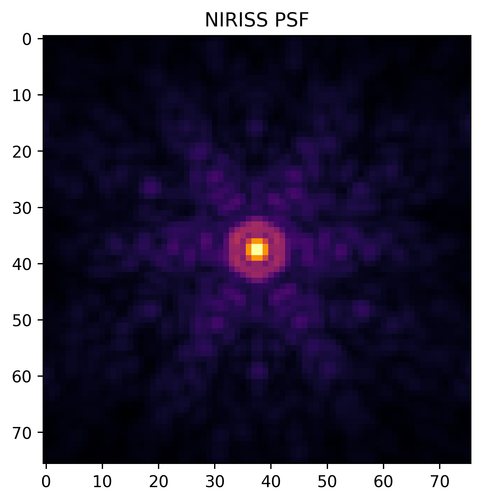

# dLuxWebbPSF

<!-- [](https://badge.fury.io/py/dLuxWebbPSF) -->
[](LICENSE)


## Description
This repository/package contains pre-built ∂Lux models of the instruments onboard the James Webb Space Telescope.

The Space Telescope Science Institute has developed [WebbPSF](https://webbpsf.readthedocs.io/en/latest/) -- a canonical Python optical simulation package which models the JWST instruments. ∂LuxWebbPSF boasts that it simulates PSF images which match WebbPSF to _machine precision_, whilst maintaining the advantages of an end-to-end differentiable framework.

[∂Lux](https://louisdesdoigts.github.io/dLux/) is an open-source differentiable optical modelling framework harnessing the structural isomorphism between optical systems and neural networks, giving forwards models of optical system as a _parametric neural network_.
∂Lux is built in [Zodiax](https://github.com/LouisDesdoigts/zodiax) which is an open-source object-oriented [Jax](https://github.com/google/jax) framework built as an extension of [Equinox](https://github.com/patrick-kidger/equinox) for scientific programming.

<!-- ## Installation

`dLuxToliman` is pip-installable. To install the latest release, simply run:

```bash
pip install dLuxWebbPSF
``` -->

## Usage

A very basic example of how to use this package is as follows:

```python
# imports
import dLuxWebbpsf as dlW
import matplotlib.pyplot as plt

# initialising telescope
telescope = dlW.NIRISS(filter="F480M")

# running optical simulation
psf = telescope.model()

# plotting
plt.imshow(psf ** 0.3, cmap="inferno")
plt.title('NIRISS PSF')
plt.show()
```



## Contributors
[Irina Troitskaya](https://github.com/itroitskaya), [Louis Desdoigts](https://github.com/LouisDesdoigts), [Max Charles](https://github.com/maxecharles), [Benjamin Pope](https://github.com/benjaminpope), and [Peter Tuthill](https://github.com/ptuthill).

<!-- ## License

This package is released under the BSD 3-Clause License. See the [LICENSE](LICENSE) file for more information. -->

## Support

If you encounter any problems or have any questions related to our package, please raise an issue or contact us!.